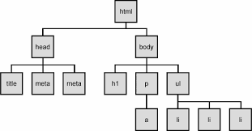
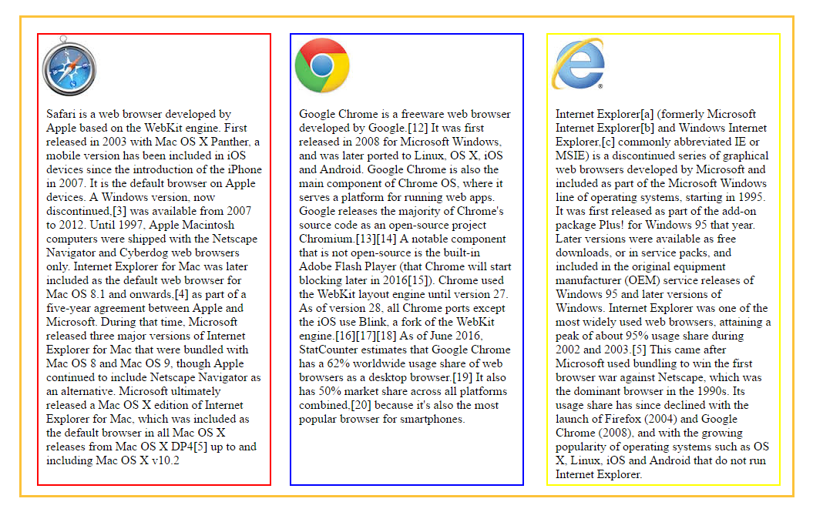

#Week plan for week 2: Frontend -HTML, CSS, Bootstrap, JS

##Day1 HTML and CSS

### Introduction to HTML

  

Most common tags are:

- div
- p
- table (rows) and (columns)
- img
- a
- ul or ol
- form
- script
- span
- h1 to h6

The different tags help define the purpose of the content and with the help of CSS styles make different types of tagged content stand out from each other See examples of HTML elements when they are not styled [here](page2_html.html). Information may be structured but it is not presented in an orderly way untill css styles are applied.


###What is CSS

2 good reference sites:  
[Tutorials point](http://www.tutorialspoint.com/css/)  
[W3School](http://www.w3schools.com/css/)

- CSS stands for Cascading Style Sheets
- Cascading Style Sheets refers to how Child elements either inherit or override property values from their parent elements.
- Where HTML is for Structure. Then CSS is for Presentation
- 3 ways to define styles with CSS
  1.  Inline styles
  2.  Internal styles
  3.  External style sheet
- Selectors : ways to point to a particular part of the HTML document for styling. Examples
  1.  p{}
  2.  div{}
  3.  '#myid{}
  4.  .redwriting{}

- Properties : ways to tell the browser what should happen with the content of a particular selector. Examples:
  1.  height: 100px;
  2.  font-color: yellow;
  3.  border: 1px solid red;
- Units : either use px (pixel) or em (1em == the font size of the element)
- IDs
- Classes
- Child elements: div p a (this means: any a-elements that are directly inside a p element
- Same style attributes to more selectors: p, img, div
[first and last element](http://www.w3schools.com/cssref/tryit.asp?filename=trycss_sel_firstchild_more3)
[n-th element](http://www.w3schools.com/cssref/tryit.asp?filename=trycss3_nth-child_odd_even)
[CSS box model](http://www.w3schools.com/css/css_boxmodel.asp)
[Float](https://developer.mozilla.org/en-US/docs/Web/CSS/float)
[Flex box](http://www.w3schools.com/css/css3_flexbox.asp)
[CSS positioning](http://www.w3schools.com/css/css_positioning.asp)


###Exercise day1:

*   Create a new webpage/html page.
*   attach a stylesheet
*   Test in browser that they are connected
*   Try using HTML and CSS to get a result as close to this picture as you can




##Day2 Bootstrap - HTML5 framework


### Responsive web design

[Bootstrap tutorial](http://www.w3schools.com/bootstrap/default.asp)


### Bootstrap CDN

3 references:

1.  link rel="stylesheet" href="http://maxcdn.bootstrapcdn.com/bootstrap/3.3.7/css/bootstrap.min.css"
2.  src="https://ajax.googleapis.com/ajax/libs/jquery/1.12.4/jquery.min.js"
3.  src="http://maxcdn.bootstrapcdn.com/bootstrap/3.3.7/js/bootstrap.min.js"

[click here for the exercise](exercise2.html)</div>


## Day3 Javascript


### Introduction

- Lets start by doing som js
  - Set up external js document to alert()
  - React to a div being clicked
  - console.log() vs alert()
  - Internal vs external js script

###Content
- What is js (Scripted, Syntax)
  - Loosely typed
  - Variables
  - Data types
  - Operators
  - Functions (methods in objects)
  - Objects
  - Array and array methods

### Oddities
[Link to oddities](https://www.smashingmagazine.com/2011/05/10-oddities-and-secrets-about-javascript/)

- Null is an object
- NaN is a Number
- NaN er ikke NaN
- Empty array is false
	(more or less..)

### Loosely typed
- Examples

### Values
- numbers, (max 64bit)
- Integer and floating points (NaN, infinity, -infinity)
- strings, 
- Booleans, 
- Operators (unary, binary and ternary)
- Objects, 
- Functions, 
- Undefined values (null and "undefined")


### Truthy vs. Falsy
-Every non-boolean value has a built-in boolean flag
```
-[ ] == false;
-null == false;
-"" == false;
-0 == false;
```
[Truthy / Falsy table](https://dorey.github.io/JavaScript-Equality-Table/)


### Operators
- Unary operators: (typeof and instanceof)
- Binary operators:
  - String Operators
  - Arithmetic Operators (+, -, *, /, %...)
  - Assignment Operators (=, +=, -=, *=, ….)
  - Logical Operators (==, ===, !==, <, >=, …)
- Ternary operators:
`var PhiIsMoreThan4 = Math.PI > 4 ? "Yep" : "Nope";`

###Functions
-	Functions vs. Methods (in objects).
-	Declaration:
-	Hoisting: 
-	Only when declared as a function.
-	IIFE (immediately Invoked Function Expression)


### Function arguments
- Extra arguments are ignored
- Too few arguments and the value will be set to undefined
- The arguments[] array accessible to all functions
- Self invoked funtions  
Here is the problem  

```javascript 
var someVar = 'hello';
setTimeout(function() { alert(someVar); }, 1000);
var someVar = 'goodbye';  
```  
Here is a possible solution  

```javascript
var someVar = 'hello';
setTimeout((function(someVar) {
	return function()  { alert(someVar); }
})(someVar), 1000);
var someVar = 'goodbye';
```


### Scope
- Scope is the set of variables you have access to.
  - Global scope (Default) == the window object.
  - Function scope
  - Nested scope
    - only in nested functions and objects
    - Not in other blocks like if and loops
 - Faked scope with call() or apply() example:

```javascript
var animal = 'dog'; // Global scope
function getAnimal(adjective) { alert(adjective+' '+this.animal); };
var myObj = {animal: 'camel'};
getAnimal.call(myObj, 'lovely'); //alerts 'lovely camel' because we are now in the myObj scope.  
//or use getAnimal.apply(myObj, ['lovely']); //apply takes array of arguments instead of commaseperated list of args.
```


###The -this- keyword
- this refers to the owner of the function we are executing. (The object that the function is a method of)
- If this is used in a function that is not a method it will refer to the global object (the window object of the browser).


###Closures
- For encapsulation  

```javascript
    var populateTable = function(){
        tb.innerHTML = "";
        for (var i = 0; i < students.length; i++) {
            var row = tb.insertRow(i);
            row.insertCell(0).innerHTML = students[i].name;
            row.insertCell(1).innerHTML = students[i].email;
            row.insertCell(2).innerHTML = students[i].phone;
            var cell = row.insertCell(3);
            var btn = document.createElement("button");
            btn.innerHTML = "Delete";
            cell.appendChild(btn);
            btn.onclick = (function(){
                var inc = i;
                return function(){
                     students.splice(inc, 1);
                    console.log("no: "+inc);
                    populateTable();
                };
            })();
        }   
    };
```

###Callback functions
- High-order functions (functions as arguments)
- To be called at a later point
- Examples:


###Callbacks continued
- Callbacks are closures (can access the containing functions scope)


###Objects
- `Var myObject = { };`
- like a Map in java (associative array)
- key / value pairs
- Can contain properties and methods.
- Constructor


###Arrays
- `[ ]`
- Properties:
- Array methods: [See them here](https://developer.mozilla.org/en-US/docs/Web/JavaScript/Reference/Global_Objects/Array)


###Exceptions and errors
- Exceptions tutorial


###filter() and map() examples
- Filter() and map()
- Example of dot notation
- Create our own filter method 
- `myFilter(array, callback)`


##Day4 Frontend app with html forms and js
- create a form with all the form elements.
- check content of form element;
- create a js array with objects to hold information from the form.
- show table with content from the array.
- Add data from form to array and display in table
- show how to add and remove a form field from the page based on button click.
- see the result [link here!](http://45.55.207.235:8080/SP2/)


##Day5 Studypoint exercise
- array of student objects
- categorize students red, yellow, green
- contact information (phone, email)
- form to add new student
- create group by ticking students and adding group name
- button by each name to remove a student.
- button to open edit form to edit student info
- sort student list by group name
- group request for tutor help
- new page with:
- array of taught topics (name, date, teacher initials)
